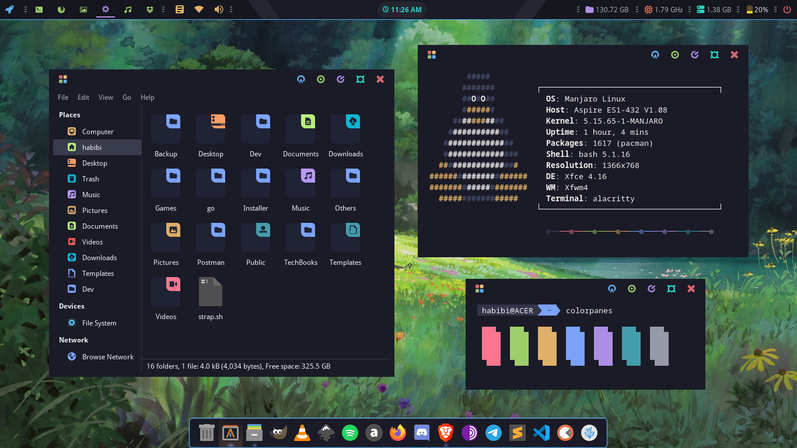

# XFCE Desktop Customization

## ❄️ My Setup
- **Color Scheme**: Tokyo Night
- **DE** : Xfce
- **WM** : Xfwm
- **Panel** : Xfce4-panel
- **App Panel** : Plank
- **Terminal** : Alacritty
- **File Manager** : Thunar
- **Shell**: bash

